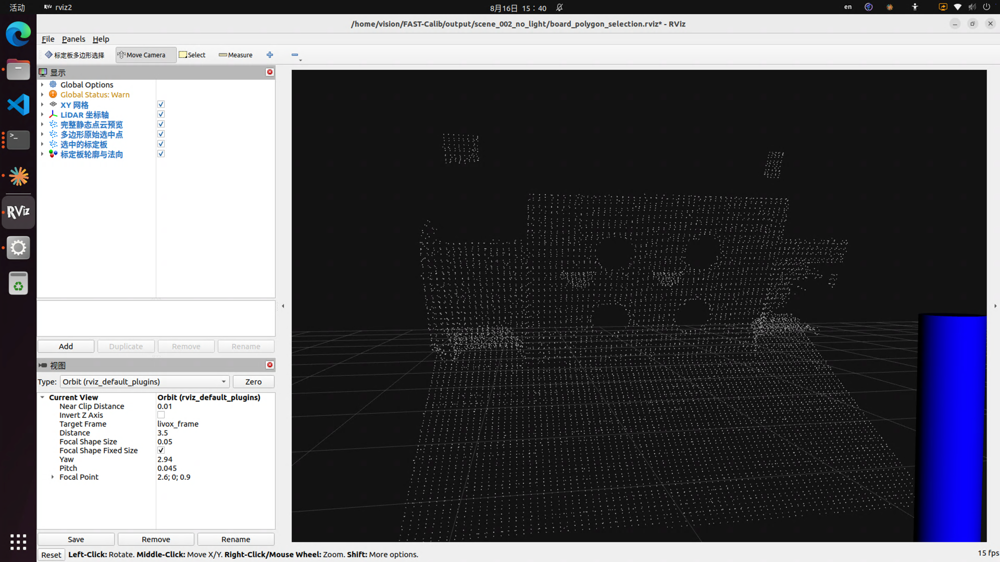
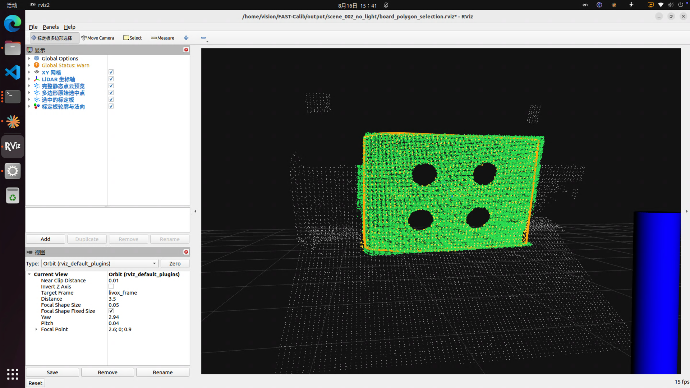
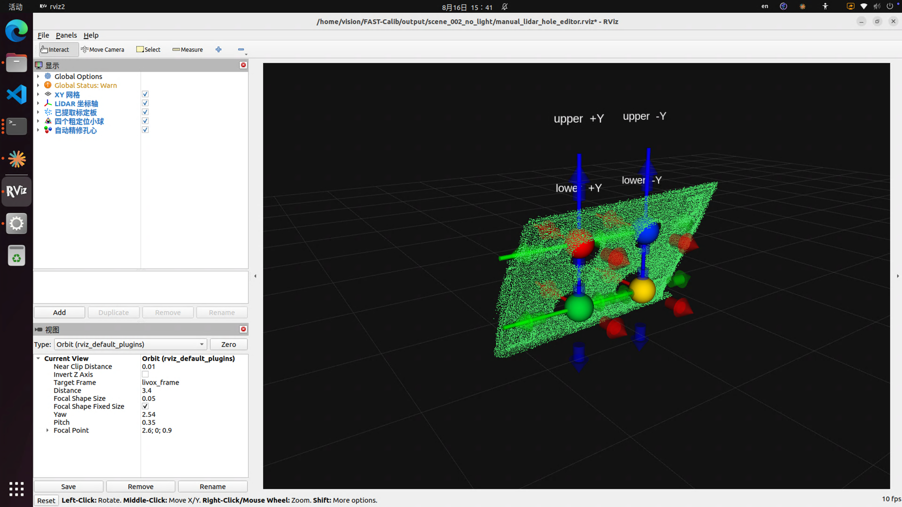
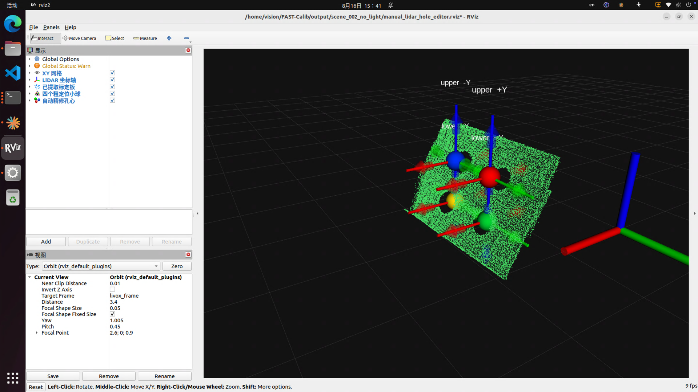
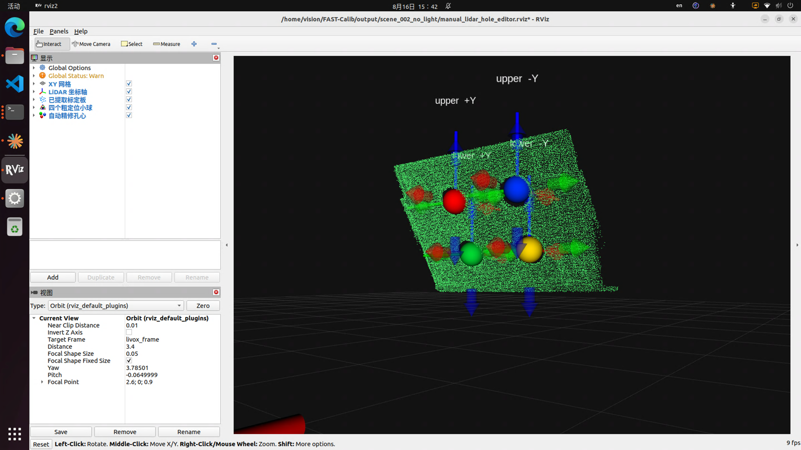
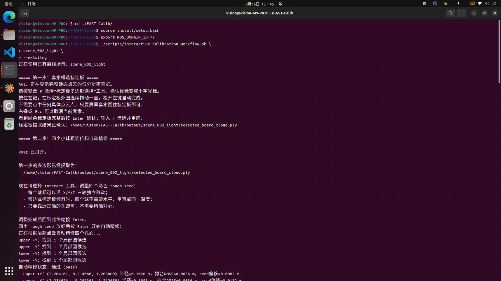
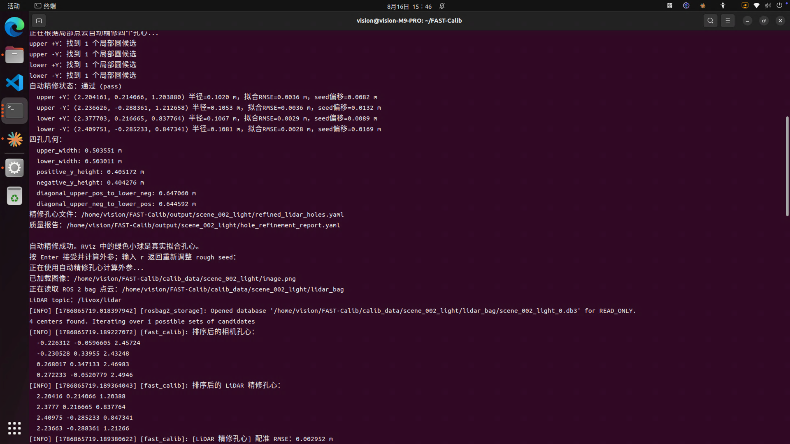
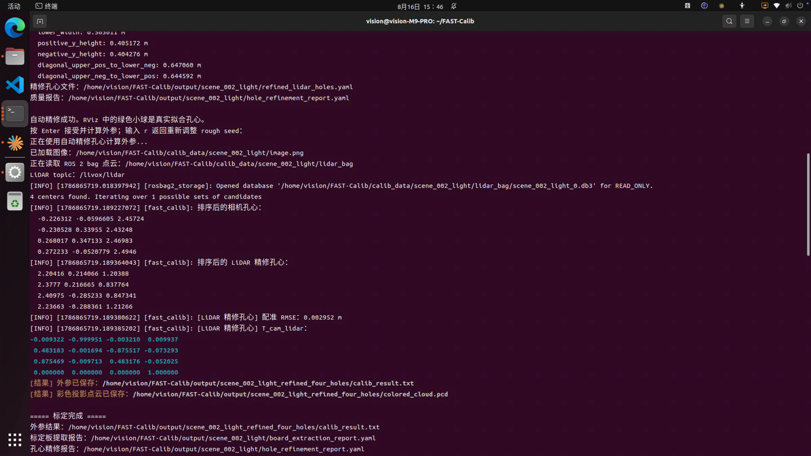

# FAST-Calib：Livox MID360 与海康工业相机外参标定

[English](README_en.md)

FAST-Calib 是一套面向 **Livox MID360 激光雷达**与**海康工业相机**的 ROS 2 静态外参标定工具。

本项目提供两种使用方式：

- **离线标定**：先将相机和 LiDAR 录制到同一个 ROS 2 bag，之后再将 bag 输入脚本完成标定；
- **现场一键标定**：运行一个脚本，自动抓取相机图像、录制 LiDAR bag，并继续完成后续交互标定。

为了兼容雷达或标定板倾斜安装，当前流程不再依赖固定方向的标定板 ROI，而是先在 RViz2 中使用套索框出标定板，再从高分辨率静态点云中提取板面，最后进行四孔粗定位、孔心自动精修和外参计算。

---

## 目录

- [功能特点](#功能特点)
- [系统与硬件要求](#系统与硬件要求)
- [安装依赖](#安装依赖)
- [配置设备](#配置设备)
- [编译](#编译)
- [标定流程概览](#标定流程概览)
- [方式一：离线标定](#方式一离线标定)
- [方式二：现场一键标定](#方式二现场一键标定)
- [RViz2 后续操作](#rviz2-后续操作)
- [输出文件](#输出文件)
- [重新处理已有场景](#重新处理已有场景)
- [常见问题](#常见问题)
- [标定记录](#标定记录)
- [许可证](#许可证)

---

## 功能特点

- 支持 Livox MID360 `sensor_msgs/msg/PointCloud2`；
- 支持海康 MVS SDK 工业相机；
- 支持相机与 LiDAR 合并 bag 的离线标定；
- 支持现场自动抓图、录制 LiDAR 和后续标定；
- 使用低分辨率完整场景预览，降低 RViz2 显示负担；
- 使用 RViz2 套索工具框选任意透视形状的标定板区域；
- 从高分辨率点云中自动拟合任意朝向的标定板平面；
- 四个 rough seed 小球可分别沿 LiDAR X/Y/Z 三轴移动；
- 自动拟合四个圆孔的真实孔心；
- 使用 `0.500 m × 0.400 m` 四孔几何进行联合验证；
- 未通过验证的 rough seed 或孔心不能进入最终外参计算；
- 支持约 45° 或其他角度的雷达、标定板倾斜安装。

---

## 系统与硬件要求

### 软件环境

| 项目 | 要求 |
| --- | --- |
| 操作系统 | Ubuntu 22.04 |
| ROS | ROS 2 Humble |
| 点云库 | PCL 1.10 或更高版本 |
| 图像库 | OpenCV |
| 编译工具 | CMake、colcon、GCC/Clang |
| Python | Python 3、NumPy、SciPy、PyYAML |

### 硬件

- Livox MID360；
- 海康 USB/GigE 工业相机；
- 四孔 ArUco 标定板；
- 能够运行 RViz2 的图形环境。

### 当前默认标定板参数

| 参数 | 默认值 |
| --- | --- |
| ArUco 字典 | `DICT_4X4_50` |
| ArUco ID | `[0, 1, 3, 2]` |
| 四孔中心横向间距 | `0.500 m` |
| 四孔中心纵向间距 | `0.400 m` |
| 孔半径 | `0.120 m` |
| LiDAR topic | `/livox/lidar` |
| LiDAR frame | `livox_frame` |

---

## 安装依赖

安装 ROS 2、PCL、RViz2 插件开发依赖和 Python 依赖：

```bash
sudo apt update
sudo apt install -y \
  ros-humble-desktop \
  ros-humble-pcl-ros \
  ros-humble-pcl-conversions \
  ros-humble-rosbag2 \
  ros-humble-interactive-markers \
  python3-colcon-common-extensions \
  python3-numpy \
  python3-scipy \
  python3-yaml \
  qtbase5-dev \
  libopencv-dev \
  libpcl-dev
```

还需要安装：

1. **海康 MVS SDK**
   - 默认安装路径：`/opt/MVS`
   - 需要提供 `MvCameraControl` 库和头文件；
2. **Livox-SDK2**
   - 需要提供 `livox_lidar_sdk_shared`；
3. **livox_ros_driver2**
   - 可以安装到系统，也可以与 FAST-Calib 放在同一个 ROS 2 工作空间中编译。

推荐工作空间结构：

```text
calib_ws/
└── src/
    ├── FAST-Calib/
    └── livox_ros_driver2/
```

---

## 配置设备

### 配置 MID360

修改：

```text
config/livox_mid360_fast_calib.json
```

确认以下内容与实际设备一致：

- MID360 IP；
- 主机 IP；
- 数据和命令端口。

启动后应得到：

```text
/livox/lidar [sensor_msgs/msg/PointCloud2]
```

可以使用以下命令检查：

```bash
ros2 topic list -t | grep /livox/lidar
ros2 topic hz /livox/lidar
```

### 配置海康相机

当前脚本默认参数：

| 参数 | 默认值 |
| --- | --- |
| 相机序列号 | `DA3217436` |
| 曝光时间 | `30000 us` |
| 增益 | `8` |
| 合并 bag 相机发布频率 | `1.0 Hz` |
| 相机 topic | `/camera/image_raw` |

可以使用环境变量覆盖：

```bash
export CAMERA_SERIAL=<相机序列号>
export EXPOSURE_US=30000
export GAIN=8
export CAMERA_RATE=1.0
```

当前相机内参位于：

```text
config/camera_params_hikvision_20260814.yaml
config/qr_params.yaml
```

更换相机、镜头、焦距或图像分辨率后，应先更新相机内参。

---

## 编译

### 在独立仓库根目录编译

```bash
cd ~/FAST-Calib
source /opt/ros/humble/setup.bash

colcon build \
  --packages-select fast_calib \
  --cmake-args -DCMAKE_BUILD_TYPE=Release

source install/setup.bash
```

### 在包含 livox_ros_driver2 的工作空间中编译

```bash
cd ~/calib_ws
source /opt/ros/humble/setup.bash

colcon build --cmake-args -DCMAKE_BUILD_TYPE=Release

source install/setup.bash
cd src/FAST-Calib
```

### 检查编译结果

```bash
ros2 pkg prefix fast_calib
```

确认 RViz2 套索插件已经生成：

```bash
ls install/fast_calib/lib/libfast_calib_rviz_plugins.so
```

如果是在上层工作空间编译，则文件通常位于：

```text
~/calib_ws/install/fast_calib/lib/libfast_calib_rviz_plugins.so
```

> 每次打开新终端后，都需要重新执行 `source /opt/ros/humble/setup.bash` 和工作空间的 `source install/setup.bash`。

---

## 标定流程概览

无论采用离线标定还是现场一键标定，数据准备完成后的流程相同：

```text
相机图像 + LiDAR bag
        ↓
生成高分辨率静态点云 static_cloud_full.ply
        ↓
生成低分辨率 RViz 预览 static_cloud_preview.ply
        ↓
在 RViz2 中用套索框选标定板
        ↓
拟合并提取 selected_board_cloud.ply
        ↓
在板面点云上拖动四个 rough seed
        ↓
自动精修四个真实孔心
        ↓
四孔几何验证
        ↓
计算 T_cam_lidar
```

---

## 方式一：离线标定

离线标定适用于：

- 先在现场录制完整数据；
- 之后撤掉标定板；
- 再将 bag 输入 FAST-Calib 进行处理。

### 1. bag 必须录制哪些 topics

合并 bag 必须同时包含：

| 数据 | 默认 topic | 消息类型 | 必需 |
| --- | --- | --- | --- |
| MID360 点云 | `/livox/lidar` | `sensor_msgs/msg/PointCloud2` | 是 |
| 相机图像 | `/camera/image_raw` | `sensor_msgs/msg/Image` | 是 |

离线导入脚本也支持：

```text
sensor_msgs/msg/CompressedImage
```

如果使用压缩图像，请在导入时传入实际的压缩图像 topic，例如：

```text
/camera/image_raw/compressed
```

> 录制期间相机、LiDAR 和标定板必须保持静止。建议录制约 20～30 秒，并在 rosbag 完全停止、metadata 写入完成后再撤掉标定板。

### 2. 推荐：使用项目脚本录制合并 bag

该脚本会自动：

- 使用独立的 `ROS_DOMAIN_ID=77`；
- 清理旧的标定传感器进程；
- 启动 MID360 PointCloud2 发布器；
- 启动海康相机 ROS 发布器；
- 检查两个 topics 都有真实消息；
- 只录制 LiDAR 和相机两个 topics；
- Ctrl+C 后等待 rosbag 刷盘；
- 验证两个 topics 的消息数量；
- 从 bag 中解码一张相机图像进行验证。

运行：

```bash
cd ~/FAST-Calib
source /opt/ros/humble/setup.bash
source install/setup.bash

./scripts/record_calibration_bag.sh \
  ~/calibration_bags/scene_001
```

开始录制后，保持设备与标定板静止约 20～30 秒，然后按一次：

```text
Ctrl+C
```

成功后会生成：

```text
~/calibration_bags/scene_001/
~/calibration_bags/scene_001_verification/
```

验证 bag：

```bash
ros2 bag info ~/calibration_bags/scene_001
```

应看到类似：

```text
Topic: /camera/image_raw | Type: sensor_msgs/msg/Image
Topic: /livox/lidar      | Type: sensor_msgs/msg/PointCloud2
```

### 3. 可选：手动录制合并 bag

如果相机和 LiDAR topics 已由其他节点发布，可以直接录制：

```bash
ros2 bag record \
  -o ~/calibration_bags/scene_001 \
  /livox/lidar \
  /camera/image_raw
```

如果需要使用本项目的传感器启动文件：

```bash
ros2 launch fast_calib calibration_sensors_launch.py
```

然后在另一个终端执行上面的 `ros2 bag record` 命令。

录制完成后必须检查：

```bash
ros2 bag info ~/calibration_bags/scene_001
```

### 4. 将合并 bag 输入标定脚本

```bash
cd ~/FAST-Calib
source /opt/ros/humble/setup.bash
source install/setup.bash

./scripts/interactive_calibration_from_bag.sh \
  offline_scene_001 \
  ~/calibration_bags/scene_001 \
  /camera/image_raw \
  /livox/lidar
```

参数含义：

```text
interactive_calibration_from_bag.sh \
  <新场景名> \
  <bag目录> \
  <相机topic> \
  <LiDAR topic>
```

脚本会：

1. 检查 bag 和 topic 类型；
2. 将 bag 硬链接或复制到 `calib_data/<scene>/lidar_bag/`；
3. 从相机 topic 选择时间中部的一帧；
4. 保存为 `calib_data/<scene>/image.png`；
5. 生成 `config/qr_params_<scene>.yaml`；
6. 生成高分辨率静态点云和低分辨率 RViz 预览；
7. 打开 RViz2 套索选板界面；
8. 继续四球粗定位、孔心精修和外参计算。

> 场景名必须是新的。脚本默认拒绝覆盖已有的 `calib_data/<scene>`、`output/<scene>` 和 `config/qr_params_<scene>.yaml`。

### 5. 只导入 bag，不立即启动 RViz2

```bash
PREPARE_ONLY=1 \
./scripts/interactive_calibration_from_bag.sh \
  offline_scene_001 \
  ~/calibration_bags/scene_001 \
  /camera/image_raw \
  /livox/lidar
```

之后再运行：

```bash
./scripts/interactive_calibration_workflow.sh \
  offline_scene_001 \
  --existing
```

---

## 方式二：现场一键标定

现场一键模式适用于标定板仍在现场，希望一个命令完成数据采集并进入后续流程的情况。

运行：

```bash
cd ~/FAST-Calib
source /opt/ros/humble/setup.bash
source install/setup.bash

./scripts/interactive_calibration_workflow.sh \
  scene_001 \
  25
```

其中：

- `scene_001`：新的场景名称；
- `25`：LiDAR bag 录制时长，单位为秒。

该模式会：

1. 检查 `/livox/lidar` 是否存在；
2. 如果不存在，自动启动 MID360 PointCloud2 驱动；
3. 通过海康 MVS SDK 抓取一张 PNG 图像；
4. 录制指定时长的 `/livox/lidar` bag；
5. 生成场景配置；
6. 生成完整静态点云和 RViz 预览点云；
7. 打开套索选板界面；
8. 打开四球粗定位界面；
9. 自动精修孔心并计算外参。

> 现场一键模式不是录制相机与 LiDAR 的合并 bag。它会先抓取一张相机 PNG，再录制 LiDAR bag，因此从抓图开始到 LiDAR 录制结束，相机、LiDAR 和标定板都必须保持静止。

可以覆盖默认相机参数：

```bash
CAMERA_SERIAL=<相机序列号> \
EXPOSURE_US=30000 \
GAIN=8 \
./scripts/interactive_calibration_workflow.sh scene_001 25
```

同样，场景名不能与已有数据重复。

---

## RViz2 后续操作

离线导入或现场采集完成后，脚本会自动进入以下两个 RViz2 阶段。

### 第一步：套索框选标定板

RViz2 打开后：

1. 如果需要调整观察角度，先选择 `Move Camera`；
2. 调整到能够清楚看到完整标定板的位置；
3. 按键盘 `P` 激活 `标定板多边形选择`；
4. 确认鼠标变成十字光标；
5. 按住左键，在标定板外围连续拖动一圈；
6. 松开左键，程序自动闭合套索并提取板面；
7. 不需要点中任何具体点云点，只需要让屏幕套索包围标定板；
8. 右键或 Esc 可以取消当前套索。

显示颜色：

| 颜色 | 含义 |
| --- | --- |
| 灰色 | 完整场景低分辨率预览 |
| 黄色 | 套索直接选中的可见点 |
| 绿色 | 从高分辨率点云中提取出的标定板 |
| 橙色线框 | 选区边界 |
| 蓝色箭头 | 标定板平面法向 |

看到绿色标定板完整后，回到终端：

- 按 Enter：确认并进入四球阶段；
- 输入 `r`：删除未确认候选并重新画套索；
- Ctrl+C：退出，未确认结果不会在下次被复用。





### 第二步：四球粗定位

1. 选择 RViz2 顶部的 `Interact`；
2. 将四个彩色球分别放到四个孔附近；
3. 不需要精确对心，小球只是 rough seed；
4. 每个球都支持独立的 `move_x`、`move_y`、`move_z`；
5. 雷达或标定板倾斜时，四球不需要保持水平、垂直或相同深度；
6. 确保四个球分别对应四个不同的孔；
7. 完成后回到终端按 Enter。







### 第三步：自动精修与确认

程序会自动：

1. 在每个 rough seed 周围搜索局部板面点云；
2. 拟合圆孔边界、半径和真实孔心；
3. 验证四孔宽度、高度和对角线；
4. 在 RViz2 中显示更小的绿色 refined centers；
5. 只有验证通过后才允许计算外参。

终端提示精修成功后：

- 按 Enter：接受精修孔心并计算外参；
- 输入 `r`：返回 RViz2 调整 rough seed；
- 精修失败时输入 `q`：停止流程。







---

## 输出文件

### 场景输入

```text
calib_data/<scene>/image.png
calib_data/<scene>/lidar_bag/
config/qr_params_<scene>.yaml
```

### 静态点云与标定板提取

```text
output/<scene>/static_cloud_full.ply
output/<scene>/static_cloud_preview.ply
output/<scene>/selected_board_cloud.ply
output/<scene>/board_extraction_report.yaml
```

### 四孔粗定位与精修

```text
output/<scene>/manual_lidar_hole_seeds.yaml
output/<scene>/refined_lidar_holes.yaml
output/<scene>/hole_refinement_report.yaml
output/<scene>/refinement_debug/
```

### 最终外参

```text
output/<scene>_refined_four_holes/calib_result.txt
output/<scene>_refined_four_holes/colored_cloud.pcd
output/<scene>_refined_four_holes/colored_cloud.ply
```

最终外参文件主要包含：

```text
Rcl：LiDAR 到相机的旋转矩阵
Pcl：LiDAR 到相机的平移向量
cam_fx / cam_fy / cam_cx / cam_cy：相机内参
cam_d0 ... cam_d4：相机畸变参数
```

验收建议：

- `board_extraction_report.yaml` 包含 `accepted: true`；
- `hole_refinement_report.yaml` 为 `status: pass`；
- 四孔配准 RMSE 小于 `0.008 m`；
- 理想 RMSE 接近或低于 `0.005 m`；
- 检查 `colored_cloud.ply` 或 `colored_cloud.pcd` 的投影效果。

---

## 重新处理已有场景

已经完成 bag 导入和场景配置后，可以直接重新进入交互流程：

```bash
./scripts/interactive_calibration_workflow.sh \
  <scene_name> \
  --existing
```

强制重新生成高、低分辨率静态点云：

```bash
REBUILD_STATIC_CLOUD=1 \
./scripts/interactive_calibration_workflow.sh \
  <scene_name> \
  --existing
```

强制重新套索框选标定板：

```bash
RESELECT_BOARD=1 \
./scripts/interactive_calibration_workflow.sh \
  <scene_name> \
  --existing
```

调整完整场景预览范围：

```bash
export FAST_CALIB_PREVIEW_MIN_X=1.0
export FAST_CALIB_PREVIEW_MAX_X=5.0
export FAST_CALIB_PREVIEW_MIN_Y=-2.0
export FAST_CALIB_PREVIEW_MAX_Y=2.0
export FAST_CALIB_PREVIEW_MIN_Z=-1.0
export FAST_CALIB_PREVIEW_MAX_Z=3.0

REBUILD_STATIC_CLOUD=1 \
./scripts/interactive_calibration_workflow.sh \
  <scene_name> \
  --existing
```

---

## 常见问题

### 1. 出现 `undefined symbol: libusb_set_option`

原因通常是海康 MVS SDK 的旧版 libusb 排在系统库之前。

临时过滤：

```bash
CLEAN_LD=$(printf '%s' "${LD_LIBRARY_PATH:-}" \
  | tr ':' '\n' \
  | grep -v '^/opt/MVS/lib' \
  | paste -sd:)
```

本项目的主要标定脚本已经在关键 PCL 命令中自动进行该处理。

### 2. RViz2 中没有 `标定板多边形选择`

重新构建并加载工作空间：

```bash
cd ~/FAST-Calib
source /opt/ros/humble/setup.bash
colcon build --packages-select fast_calib --cmake-args -DCMAKE_BUILD_TYPE=Release
source install/setup.bash
```

确认插件存在：

```bash
ls install/fast_calib/lib/libfast_calib_rviz_plugins.so
```

### 3. 套索工具没有激活

按键盘：

```text
P
```

鼠标应变成十字光标。套索不要求点中点云，按住左键围住标定板后松开即可。

### 4. RViz2 中看不到完整标定板

扩大预览范围，然后重新生成静态点云：

```bash
export FAST_CALIB_PREVIEW_MIN_X=1.0
export FAST_CALIB_PREVIEW_MAX_X=5.0
export FAST_CALIB_PREVIEW_MIN_Y=-2.0
export FAST_CALIB_PREVIEW_MAX_Y=2.0
export FAST_CALIB_PREVIEW_MIN_Z=-1.0
export FAST_CALIB_PREVIEW_MAX_Z=3.0

REBUILD_STATIC_CLOUD=1 \
RESELECT_BOARD=1 \
./scripts/interactive_calibration_workflow.sh <scene_name> --existing
```

### 5. 输入 `r` 后下次仍复用错误结果

当前版本只有以下两个条件同时满足时才会复用：

```text
selected_board_cloud.ply 存在
board_extraction_report.yaml 包含 accepted: true
```

未确认的候选文件不会作为正式结果使用。

### 6. 四个小球不能拖动

检查：

- RViz2 工具是否为 `Interact`；
- Display 是否为 `rviz_default_plugins/InteractiveMarkers`；
- Namespace 是否为 `/manual_lidar_holes`；
- 深度方向难以拖动时，使用 `move_x`、`move_y`、`move_z` 三轴手柄。

### 7. 脚本拒绝覆盖已有场景

这是为了防止覆盖 bag、图像和标定结果。请使用新的场景名称，例如：

```text
scene_001_v2
scene_002_light_v2
```

或者使用已有场景入口：

```bash
./scripts/interactive_calibration_workflow.sh <scene_name> --existing
```

### 8. 找不到 livox_ros_driver2

确保当前环境能够找到驱动：

```bash
ros2 pkg prefix livox_ros_driver2
```

如果驱动安装在单独目录，可以设置：

```bash
export LIVOX_ROS_DRIVER2_PREFIX=/path/to/livox_ros_driver2/install/livox_ros_driver2
```

---

## 标定记录

详细设计、历史结果和问题记录位于：

```text
calibration_record/
```

主要文档：

- `calibration_record/quick_start.md`
- `calibration_record/interactive_workflow.md`
- `calibration_record/rough_seed_refinement_plan.md`
- `calibration_record/device_config.md`
- `calibration_record/pitfalls_and_solutions.md`
- `calibration_record/final_result_20260617.md`

历史参考结果：

```text
output/final_success_20260617/calib_result.txt
```

---

## 许可证

本项目遵循仓库中的 [LICENSE](LICENSE)。

RViz2 点云套索交互设计参考说明见：

```text
docs/THIRD_PARTY_NOTICES.md
```
